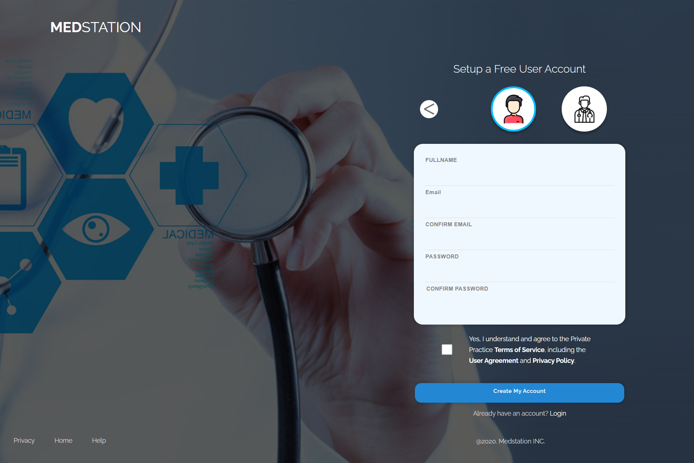

# **PRIVATE PRACTICE**

## **Description**

This repository contains the website project of Private-Practice.

Private-Practice is a platform birthed to easily fetch doctors that are specialists in particular fields.

## **Stack/Build Tools**

- HTML
- SCSS
- Bootstrap
- Javascript (With React Js as framework)

## **A ScreenShot of the app**

## **Setup for compiling SCSS**

This project uses SCSS for styling, and Gulp.JS is used for compiling the SCSS files into plain CSS.
A gulp.Js script containing all the needed configurations is included.

A package.json file is also included in the repository. Hence, simply running the command below when inside the project folder, should install all the dependencies listed in the package.json file, And get everything set for compiling SCSS into regular CSS.

Note that you'll need to have Node.JS installed on you machine. Because this process requires NPM.

> npm install

The gulp.js script is configured to watch for changes in all SCSS files, and then to compile them into regular CSS. however, the command below , must be run for the watching process to begin.

> gulp watch

Always run the "gulp watch" command before begining any development process with SCSS or else, the compilation process will not begin.
